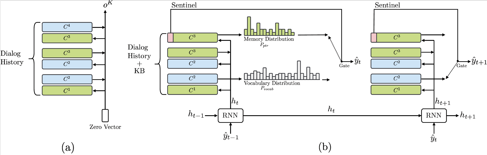
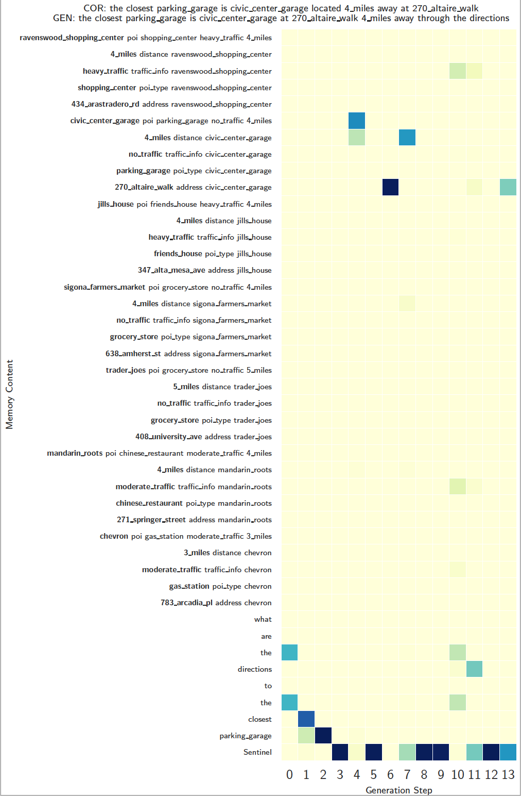

# Mem2Seq 
**Mem2Seq: Effectively Incorporating Knowledge Bases into End-to-End Task-Oriented Dialog Systems** (ACL 2018), Madotto, A., Wu, CS., Fung, P.. Accepted at ***ACL 2018***. Preprint available at: [http://arxiv.org/abs/1804.08217](http://arxiv.org/abs/1804.08217).


Andrea Madotto and Chien-Sheng Wu contribute equally at this work.  

<p align="center">

</p>

## Mem2Seq in pytorch 
In this repository we implemented Mem2Seq and several baseline in pytorch (Version 0.2). To make the code more reusable we diveded each model in a separated files (obivuosly there is a large code overlap). In the folder models you can find the following:
- ***Mem2Seq***: Memory to Sequence (Our model)
- ***Seq2Seq***: Vanilla seq2seq model with no attention (enc_vanilla)
- ***+Attn***: Luong attention attention model
- ***Ptr-Unk***: combination between Bahdanau attention and Pointer Networks ([Point to UNK words](http://www.aclweb.org/anthology/P16-1014)) 

All of these file share the same structure, which is: a class that builds an encoder and a decoder, and provide training and validation methods (all inside the class).

## Import data
Under the utils folder, we have the script to import and batch the data for each dataset. 

## Basic example
Mem2Seq can be considered as a general sequence to sequence model with the ability to address external memories. We prepared a very basic implementation (including data preprocessing and model) for a English to France translation task. Obviusly there is not much to copy from the input in this small corpus, so it is just to show how the model works in a general sequence to sequence task. Run:
```console
❱❱❱ python3 main_nmt.py
```
This version uses a flat memory instead of triple as described in the paper. 

## Train a model for task-oriented dialog datasets
We created  `main_train.py` to train models. You can see there is a notation, `globals()[args['decoder']]`, it is converting a string into a fuction. So to train a model you can run:
Mem2Seq bAbI t1-t6:
```console
❱❱❱ python3 main_train.py -lr=0.001 -layer=1 -hdd=12 -dr=0.0 -dec=Mem2Seq -bsz=2 -ds=babi -t=1 
❱❱❱ python3 main_train.py -lr=0.001 -layer=1 -hdd=12 -dr=0.0 -dec=VanillaSeqToSeq -bsz=2 -ds=babi -t=1
❱❱❱ python3 main_train.py -lr=0.001 -layer=1 -hdd=12 -dr=0.0 -dec=LuongSeqToSeq -bsz=2 -ds=babi -t=1
❱❱❱ python3 main_train.py -lr=0.001 -layer=1 -hdd=12 -dr=0.0 -dec=PTRUNK -bsz=2 -ds=babi -t=1
```
or Mem2Seq In-Car
```console
❱❱❱ python3 main_train.py -lr=0.001 -layer=1 -hdd=12 -dr=0.0 -dec=Mem2Seq -bsz=2 -ds=kvr -t=
❱❱❱ python3 main_train.py -lr=0.001 -layer=1 -hdd=12 -dr=0.0 -dec=VanillaSeqToSeq -bsz=2 -ds=kvr -t=
❱❱❱ python3 main_train.py -lr=0.001 -layer=1 -hdd=12 -dr=0.0 -dec=LuongSeqToSeq -bsz=2 -ds=kvr -t=
❱❱❱ python3 main_train.py -lr=0.001 -layer=1 -hdd=12 -dr=0.0 -dec=PTRUNK -bsz=2 -ds=kvr -t=
```

the option you can choose are:
- `-t` this is task dependent. 1-6 for bAbI and nothing for In-Car
- `-ds` choose which dataset to use (babi and kvr)
- `-dec` to choose the model. The option are: Mem2Seq, VanillaSeqToSeq, LuongSeqToSeq, PTRUNK
- `-hdd` hidden state size of the two rnn
- `-bsz` batch size
- `-lr` learning rate
- `-dr` dropout rate
- `-layer` number of stacked rnn layers, or number of hops for Mem2Seq


While training, the model with the best validation is saved. If you want to reuse a model add `-path=path_name_model` to the function call. The model is evaluated by using per responce accuracy, WER, F1 and BLEU.

## Visualization Memory Access

<p align="center">

</p>
